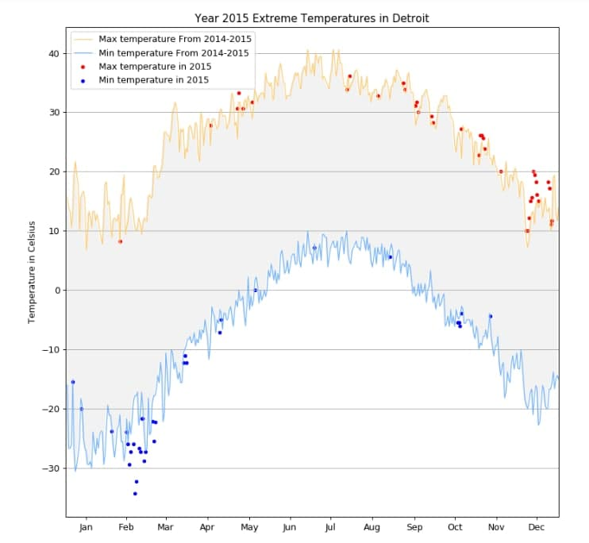

# Module 2 - Basic Charting
- Worked with real world CSV data
- Learned how to create a line graph using matplotlib
- Manipulated data to get the minimum and maximum temperature
- Demonstrated procedure of composite charts

Useful readings:

1. [Ten Simple Rules for Better Figures](https://journals.plos.org/ploscompbiol/article?id=10.1371/journal.pcbi.1003833)

Assignment 2 Final graphics:

