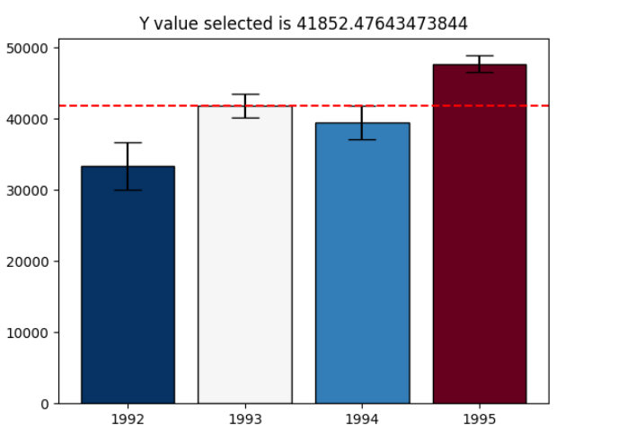

# Module 3 - Charting Fundamentals
- Work to implement a new visualization technique based on academic research. 
- Learned how to allow user to interact with graphs
- Introduced to subplots, heatmaps, boxplots and histograms

Useful Readings:
1. [Selecting the Number of Bins in a Histogram](http://users.stat.umn.edu/~gmeeden/papers/hist.pdf)

Assignment 3 Final graphics:

s